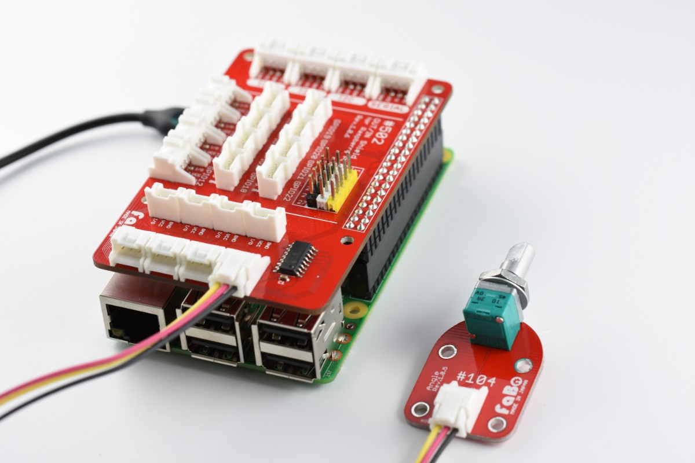
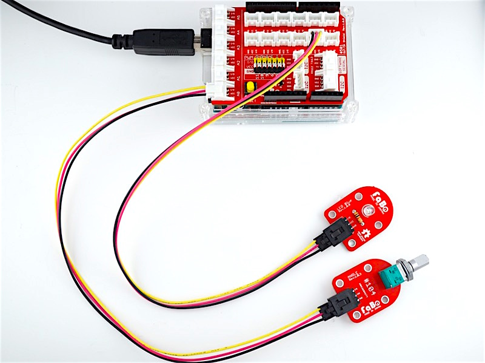

# #104 Angle Brick

[](../img/100_analog/product/104.jpg)
<!--COLORME-->

## Overview
ボリューム抵抗を使ったBrickです。

I/Oピンからアナログ値を取得することができます。

LED Brickの明るさを調節する際などに使用します。

## 接続

アナログコネクタ(A0〜A7)のいずれかに接続します。

### Raspberr Pi


### Arduino


##Schematic


## Sample Code

A0コネクタにAngle Brickを接続して、D3コネクタに接続したLED Brickの明るさ調節に使用しています。

```python
# coding: utf-8
import RPi.GPIO as GPIO
import spidev
import time
import sys

# A0コネクタにAngleを接続
ANGLEPIN = 0

# GPIO4コネクタにLEDを接続
LEDPIN = 4

#######################################################################
def readadc(channel):
	"""
	Analog Data Converterの値を読み込む
	@channel チャンネル番号
	"""
	adc = spi.xfer2([1,(8+channel)<<4,0])
	data = ((adc[1]&3) << 8) + adc[2]
	return data

#######################################################################
def map(x, in_min, in_max, out_min, out_max):
	"""
	map関数
	@x 変換したい値
	@in_min 変換前の最小値
	@in_max 変換前の最大値
	@out_min 変換後の最小
	@out_max 変換後の最大値
	@return 変換された値
	"""
	return (x - in_min) * (out_max - out_min) // (in_max - in_min) + out_min

# GPIOポートを設定
GPIO.setmode( GPIO.BCM )
GPIO.setup( LEDPIN, GPIO.OUT )

# PWM/100Hzに設定
LED = GPIO.PWM(LEDPIN, 100)

# 初期化
LED.start(0)
spi = spidev.SpiDev()
spi.open(0,0)
spi.max_speed_hz = 5000

try:
	while True:
		data = readadc(ANGLEPIN)
		print("adc : {:8} ".format(data))
		value = map(data, 0, 1023, 0, 100)
		LED.ChangeDutyCycle(value)
		time.sleep( 0.01 )
except KeyboardInterrupt:
	LED.stop()
	GPIO.cleanup()
	spi.close()
	sys.exit(0)
```

## 構成Parts
- ボリューム抵抗器A 10k

## GitHub
- https://github.com/FaBoPlatform/FaBo/tree/master/104_angle
