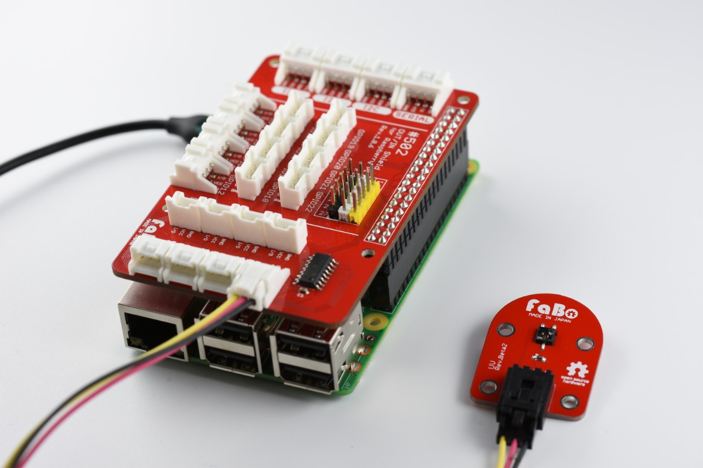

# #114 UV Brick

<!--COLORME-->

## Overview
紫外線センサーを使用したBrickです。I/Oピンより、紫外線の強弱をアナログ値(0〜1023)で取得することができます。

## 接続
### Arduino
アナログコネクタ(A0〜A5)のいずれかに接続します。

### Raspberr Pi

### IchigoJam
アナログ用コネクタ(IN2またはANA()で設定したコネクタ)のどれかに接続します。

## Support
|Arduino|IchigoJam|
|:--:|:--:|
|◯|◯|

## 回路図

## Sample Code

## Parts
- GaAsPフォトダイオードG6262

## GitHub
- https://github.com/FaBoPlatform/FaBo/tree/master/114_uv
