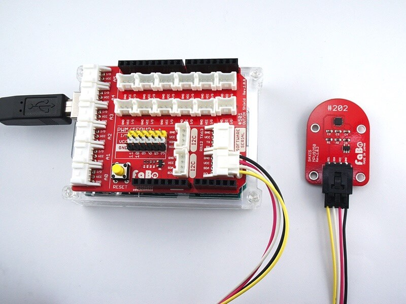
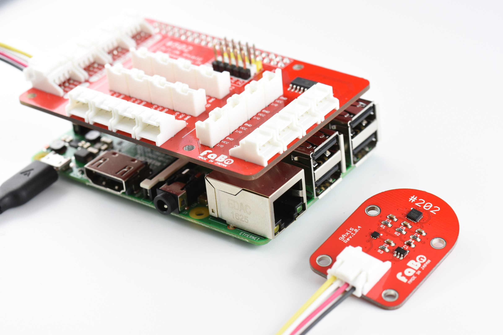
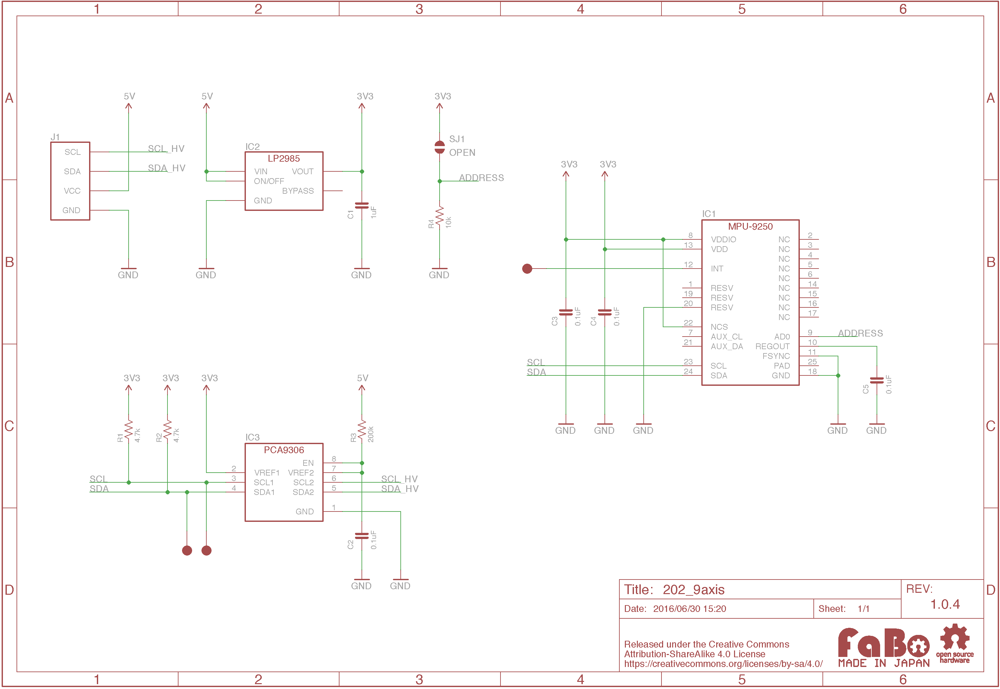
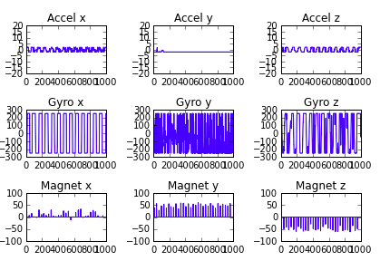
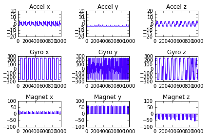
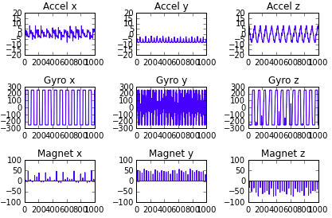
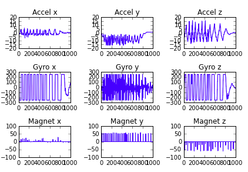

# #202 9Axis I2C Brick

[](../img/200_i2c/product/202.jpg)
<!--COLORME-->

## Overview
1チップで3軸加速度、3軸ジャイロ、3軸コンパスを取得できるセンサを使用したBrickです。

I2Cでデータを取得できます。

## 接続
I2Cコネクタへ接続します。

### Arduino

### Raspberry Pi


## MPU-9250 Datasheet
| Document |
| -- |
| [MPU-9250 Register Map](http://43zrtwysvxb2gf29r5o0athu.wpengine.netdna-cdn.com/wp-content/uploads/2015/02/MPU-9250-Register-Map.pdf) |
| [MPU-9250 Datasheet](http://43zrtwysvxb2gf29r5o0athu.wpengine.netdna-cdn.com/wp-content/uploads/2015/02/MPU-9250-Datasheet.pdf) |

## Register
MPU-9250は、三軸加速度、ジャイロ用とコンパス用の2つのI2C Slave Addressがあります。

### MPU-9250(三軸加速度、ジャイロ)
|Slave Address|
|--|--|
|0x68|

### AK8963(コンパス)
|Slave Address |
|--|--|
|0x0C|

## 回路図


## Library

- pipからインストール
```
pip install FaBo9Axis_MPU9250
```
- [Library GitHub](https://github.com/FaBoPlatform/FaBo9AXIS-MPU9250-Python)
- [Library Document](http://fabo.io/doxygen/FaBo9AXIS-MPU9250-Python/)

## Sample Code


### for Raspberry Pi
I2Cコネクタに接続した9Axis I2C Brickより３軸加速度、３軸ジャイロ、３軸コンパス情報を取得し、コンソールに出力します。

```python
# coding: utf-8
## @package faboMPU9250
#  This is a library for the FaBo 9AXIS I2C Brick.
#
#  http://fabo.io/202.html
#
#  Released under APACHE LICENSE, VERSION 2.0
#
#  http://www.apache.org/licenses/
#
#  FaBo <info@fabo.io>

import FaBo9Axis_MPU9250
import time
import sys

mpu9250 = FaBo9Axis_MPU9250.MPU9250()

try:
while True:
accel = mpu9250.readAccel()
print " ax = " , ( accel['x'] )
print " ay = " , ( accel['y'] )
print " az = " , ( accel['z'] )

gyro = mpu9250.readGyro()
print " gx = " , ( gyro['x'] )
print " gy = " , ( gyro['y'] )
print " gz = " , ( gyro['z'] )

mag = mpu9250.readMagnet()
print " mx = " , ( mag['x'] )
print " my = " , ( mag['y'] )
print " mz = " , ( mag['z'] )
print

time.sleep(0.5)

except KeyboardInterrupt:
sys.exit()
```

```python
configMPU9250(gfs,afs)
```  
でデータの取得できる範囲を変更できます  

gfs   : 限界(dps)  
0x00 -> ±250  
0x01 -> ±500  
0x02 -> ±1000  
0x03 -> ±2000  

afs   : 限界(g)  
0x00 -> ±2    
0x01 -> ±4  
0x02 -> ±8  
0x03 -> ±16  


```python
mpu9250.configMPU9250(0x00,0x00)
```

```python
mpu9250.configMPU9250(0x00,0x01)
```

```python
mpu9250.configMPU9250(0x00,0x02)
```

```python
mpu9250.configMPU9250(0x00,0x03)
```


ボタンが押された時の前後0.5秒間のデータをグラフにして出力します。
```python
#coding: utf-8
import matplotlib.pyplot as plt
import numpy as np
import FaBo9Axis_MPU9250
import time
import sys
import RPi.GPIO as GPIO
%matplotlib inline

mpu9250 = FaBo9Axis_MPU9250.MPU9250()
i=0
t=0
co=0
value=[]
data=[]
title=["Accel x","Accel y","Accel z","Gyro x","Gyro y","Gyro z","Magnet x","Magnet y","Magnet z"]
GPIO.setwarnings(False)
GPIO.setmode(GPIO.BCM)
GPIO.setup(5,GPIO.IN)

def plotgr():
array = np.array(data)
for j in range(0,9):
plt.subplot(3,3,j+1)
plt.title(title[j])
plt.plot(array[:,j])
plt.tight_layout()
plt.show()

try:
while True:
t+=1
if co>0:
co+=1
a = mpu9250.readAccel()
g = mpu9250.readGyro()
m = mpu9250.readMagnet()
value=(a['x'],a['y'],a['z'],g['x'],g['y'],g['z'],m['x'],m['y'],m['z'])
data.append(value)
if len(data)==12:
del data[0]
if GPIO.input(5):
if co==0 :
co=1
if co==6:
co=0
plotgr()
time.sleep(0.1)

except KeyboardInterrupt:
sys.exit()

```

## 構成Parts
- InvenSense MPU-9250

## GitHub
- https://github.com/FaBoPlatform/FaBo/tree/master/202_9axis
