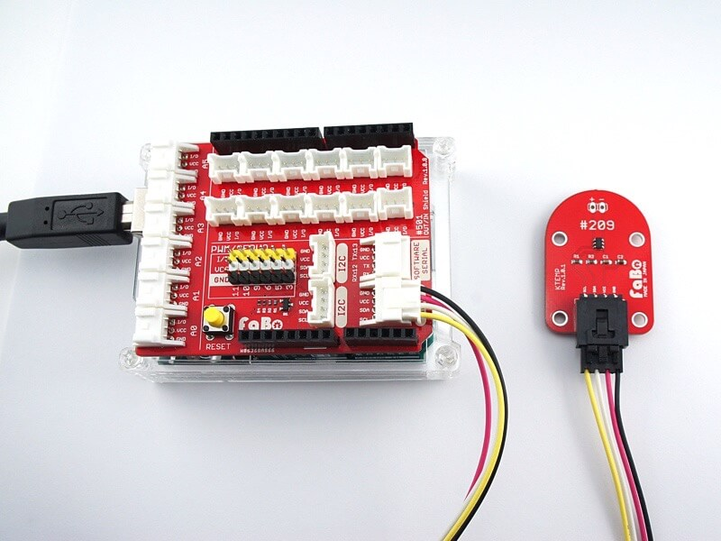
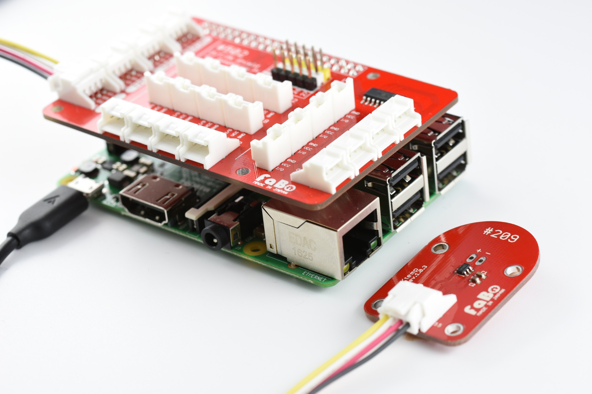
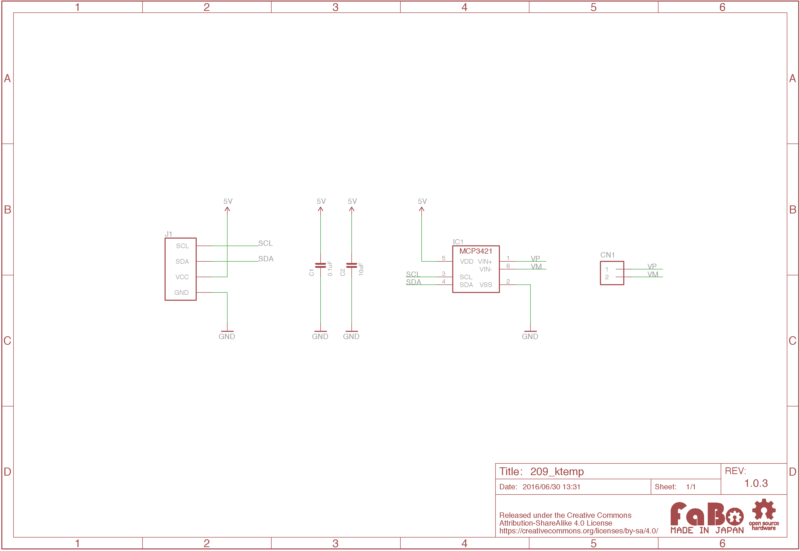

# #209 Ktemp I2C Brick

[](../img/200_i2c/product/209.jpg)
<!--COLORME-->

## Overview
K型熱電対を接続できるBrickです。
I2Cでデータを取得できます。

## 接続
I2Cコネクタへ接続します。

### Arduino

### Raspberry Pi

## MCP3421 Datasheet
| Document |
| -- |
| [MCP3421 Datasheet](http://ww1.microchip.com/downloads/en/DeviceDoc/22003e.pdf) |

## Register
| Slave Address |
| -- |
| 0x68 - 0x6F |
MCP3421のSlave Addressは0x68〜0x6Fのものが存在し、その値は工場出荷時に決まっており、後から変更することはできません。
FaBoBrickでは、0x68、または0x69の２種類を使用しています。

## 回路図


## Library

- pipからインストール

```
$ sudo pip install FaBoKTemp_MCP3421
```

- [Library GitHub](https://github.com/FaBoPlatform/FaBoKTemp-MCP3421-Python)
- [Library Document](http://fabo.io/doxygen/FaBoKTemp-MCP3421-Python/)

## Sample Code

KTemp Brickはデバイスアドレスはサンプルプログラムと異なることがあります。
(0x68〜0x6F)

i2cのセンサーを接続後、下記コマンドにて確認して下さい。

サンプルでは0x69となっていますので、異なる場合は対象のアドレスに変更してご使用下さい。

```
sudo i2cdetect -y 1
```

このサンプルは、I2Cコネクタに接続したKtemp BrickにK型熱電対を接続し、熱電対から取得した値を温度に変換してコンソールに出力します。

```python
# coding: utf-8
import FaBoKTemp_MCP3421
import time
import sys

mcp3421 = FaBoKTemp_MCP3421.MCP3421()

try:
    while True:
        t = mcp3421.read()
        sys.stdout.write("\rKTemp=%f" % (t))
        sys.stdout.flush()
        time.sleep(0.5)

except KeyboardInterrupt:
    sys.exit()
```

## Parts
- Microchip Technology MCP3421

## GitHub
- https://github.com/FaBoPlatform/FaBo/tree/master/209_ktemp
