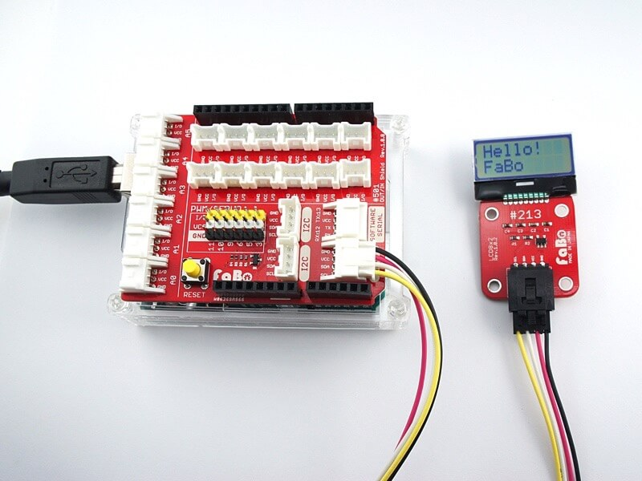

# #213 LCD mini I2C Brick (非対応)

本製品はRaspberryPIには非対応です。

<!--COLORME-->

## Overview
8桁×2行の小さいLCDを使用したBrickです。

I2Cで表示データを制御できます。

## 接続
I2Cコネクタへ接続します。

## AQM0802A Datasheet
| Document |
| -- |
| [AQM0802A Datasheet](http://akizukidenshi.com/catalog/g/gP-06669/) |

## Register
| I2C Slave Address |
|:-- |
| 0x3E |

## 回路図

## Parts
- AQM0802A

## GitHub
- https://github.com/FaBoPlatform/FaBo/tree/master/213_lcd_mini
