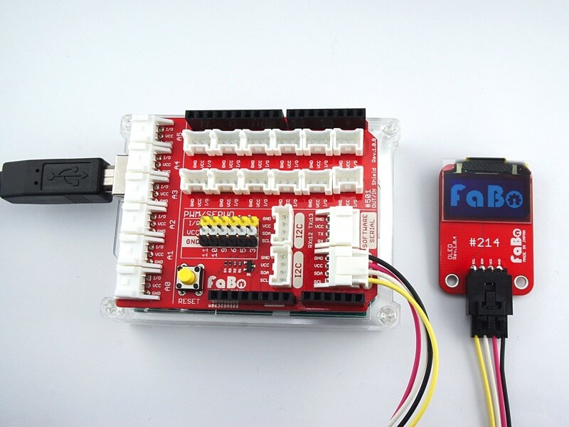
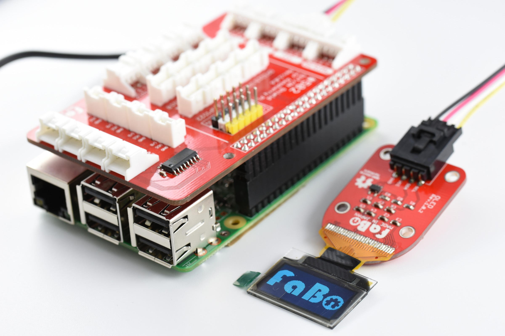
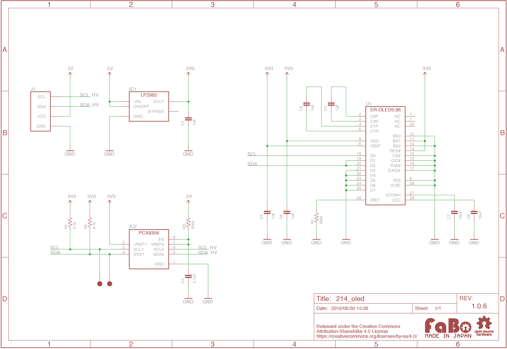

# #214 OLED I2C Brick

[](../img/200_i2c/product/214.jpg)
<!--COLORME-->

## Overview
有機ELモジュールを使用したBrickです。

I2Cで表示データを制御できます。

## 接続
I2Cコネクタへ接続します。

### Arduino

### Raspberry Pi


## ER-OLED0.96 Datasheet
| Document |
| -- |
| [ER-OLED0.96 Datasheet](http://www.buydisplay.com/download/manual/ER-OLED0.96_Series_Datasheet.pdf) |

## Register
| Slave Address |
| -- |
| 0x3C |

## 回路図


## Library

- pipからインストール

```
$ sudo pip install FaBoOLED_EROLED096
```
- [Library GitHub](https://github.com/FaBoPlatform/FaBoOLED-EROLED096-Python)
- [Library Document](http://fabo.io/doxygen/FaBoOLED-EROLED096-Python/)

## Sample Code

上記のRapberryPI Python Libraryをインストールしてからご使用ください。

```python
# coding: utf-8
import FaBoOLED_EROLED096
import time
import sys

oled = FaBoOLED_EROLED096.EROLED096()

time.sleep(1)

try:
    oled.clear()


    oled.showBitmap()

    time.sleep(1)
    oled.clear()
    time.sleep(1)

    oled.write("* OLED SAMPLE *")

    i = 0

    while True:
        oled.setCursor(0,1)
        oled.write("--OUTPUT DATA--")

        oled.setCursor(1,2)
        oled.write("I :")
        oled.write(i)

        oled.setCursor(1,3)
        oled.write("I/10:")
        oled.write(i*0.1)

        oled.setCursor(0,4)
        oled.write("--OUTPUT LIST--")

        oled.setCursor(1,5)
        oled.write(["BIN:", str(bin(i))])

        oled.setCursor(1,6)
        oled.write(["HEX:", str(hex(i))])

        time.sleep(1)
        i += 1

except KeyboardInterrupt:
    oled.clear()
    sys.exit()
```

## 構成Parts
- 128x96 0.96OLED Module

## GitHub
- https://github.com/FaBoPlatform/FaBo/tree/master/214_oled
