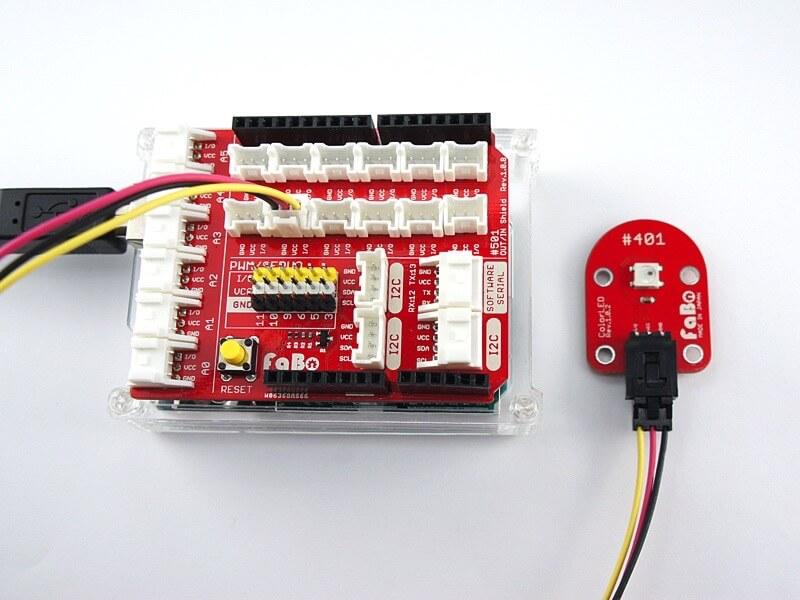
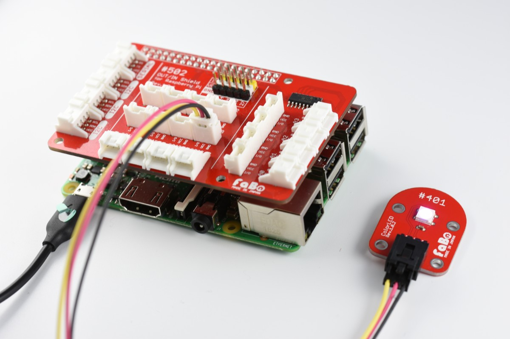
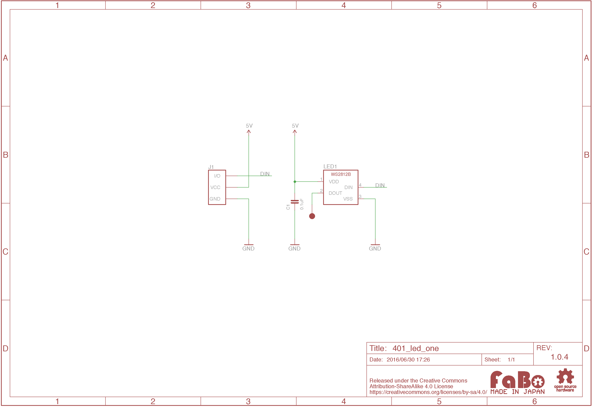

# #401 ColorLED One

[](../img/400_led/product/401.jpg)
<!--COLORME-->

## Overview
RGB Color LEDを使ったBrickです。

## 接続
アナログコネクタ(A0〜A5)、またはデジタルコネクタ(2〜13)のどれかに接続します。

### Arduino


### Raspberry Pi

## Support
|Arduino|RaspberryPI|
|:--:|:--:|
|◯|◯|

## WS2812B Datasheet
|Document|
|--|
|[WS2812B Datasheet](http://www.adafruit.com/datasheets/WS2812B.pdf)|

## 回路図


## Libraryの設定

```
$ sudo apt-get install scons swig
$ git clone https://github.com/jgarff/rpi_ws281x.git
$ cd rpi_ws281x
$ scons
$ cd python
$ sudo python setup.py install
```

## Sample

```python
# coding: utf-8
import time
from neopixel import *

# LED strip configuration:
LED_COUNT = 1  # LEDの数.
LED_PIN = 18      # Color LED Brickの接続先.
LED_FREQ_HZ = 800000  # LED signal frequency in hertz (usually 800khz)
LED_DMA = 5 # DMA channel to use for generating signal (try 5)
LED_BRIGHTNESS = 255 # Set to 0 for darkest and 255 for brightest
LED_INVERT     = False   # True to invert the signal (when using NPN transistor level shift)

# Color sensor
c = Adafruit_NeoPixel(LED_COUNT, LED_PIN, LED_FREQ_HZ, LED_DMA, LED_INVERT, LED_BRIGHTNESS)
c.begin()

r = 0
while True:
    c.setPixelColor(0, Color(r,100,100)) 
    c.show()
    r += 1
    if r > 255:
        r = 0
    time.sleep(0.01)
```

## Parts
- RGB LED WS2812B

## GitHub
- https://github.com/FaBoPlatform/FaBo/tree/master/401_led
