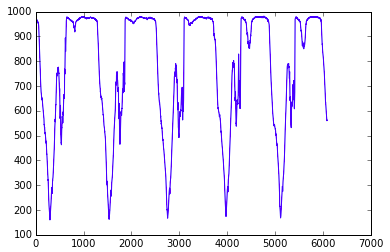
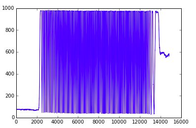
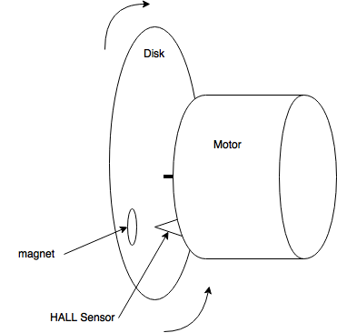
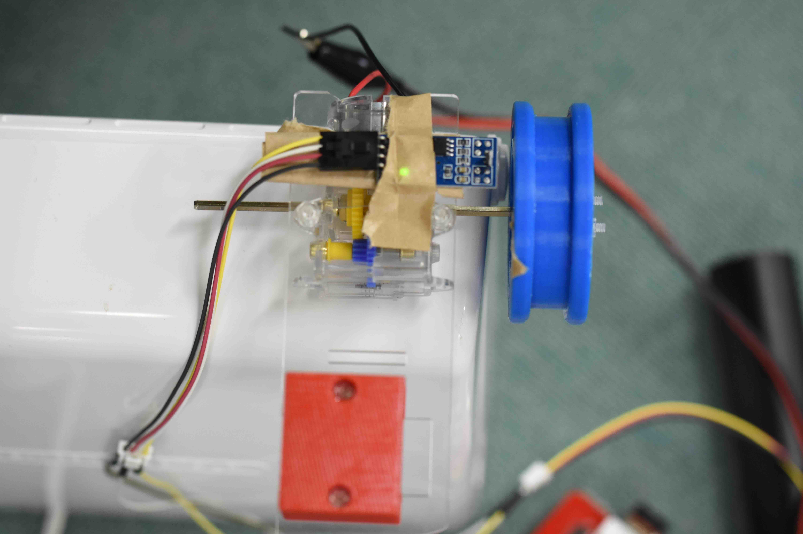

# 磁力センサとフォトリフレクタによる回転数の取得

## フォトリフレクタによる回転数の取得
下記のコードを用いて回転数の測定を行う。
``` python
import RPi.GPIO as GPIO
import spidev
import time
import sys
import numpy as np
import matplotlib.pyplot as plt 
#%matplotlib inline
#for jupyter
LEDPIN = 12
SENPIN = 0

GPIO.setwarnings(False)
GPIO.setmode(GPIO.BCM)
GPIO.setup(LEDPIN,GPIO.OUT)
LED = GPIO.PWM(LEDPIN,100)
val = 0
spi = spidev.SpiDev()
spi.open(0,0)
dis_list = np.array([])
dis_array = []
fl=0
co = 0
# def plotgr():
#     plt.plot(dis_list)
#     plt.tight_layout()
#     plt.show()
def readadc(channel):
    adc = spi.xfer2([1,(8+channel)<<4,0])
    data = ((adc[1]&3)<<8)+adc[2]
    return data
if __name__ == '__main__':
    try:
        
        while True:
            LED.ChangeDutyCycle(val % 100)
            val += 1
            data = readadc(SENPIN)
            if data > 250 and fl==0:
                fl=1
            elif data >600 and fl == 1:
                fl=2
            elif data < 250 and fl == 2:
                fl=0
                co+=1
                print co
            
            # dis_list = np.append( dis_list, data)
            # print dis_list
            dis_array.append(data)
            time.sleep(0.001)
           # print dis_array
        
    except KeyboardInterrupt:
        GPIO.cleanup()
        print co
        #print dis_array
        plt.plot(dis_array)
        plt.show()
        sys.exit(0)
```
モータに取り付けた以下のような色付きの円盤を利用し、その色の明暗により回転数の取得をする。

<!--  -->


測定したグラフは以下のようになっている



なお、実際の回転数測定に用いたグラフは以下である



円盤の明暗の規則性を利用し、変数`fl`を三段階のステージにわけることで`fl==0`の際に変数`co`に回転数をカウントさせる

## ホールセンサを用いた回転数の取得との比較
ホールセンサを用いた回転数の取得方法も実装。
回転する円盤に磁石を取り付け、ホールセンサを通過した際にカウントをする仕組みである

``` python
# coding: utf-8
# Did not use "call back" with digital output
# This algorithm use hall effect
# Fabo & M3144(http://www.aitendo.com/product/10706)
# Use Digital output
# This Program calculate length of fishing line

import RPi.GPIO as GPIO
import time
import math

HALL_SENSOR = 22

length_of_fishing_line = 6

GPIO.setwarnings(False)
GPIO.setmode( GPIO.BCM )
GPIO.setup( HALL_SENSOR, GPIO.IN )

# If you want to user Analog output then use it
# def readadc(channel):
#     adc = spi.xfer2([1,(8+channel)<<4,0])
#        data = ((adc[1]&3) << 8) + adc[2]
#         return data

if __name__ == '__main__':
    try:
        i = 0
        while True:
            while GPIO.input( HALL_SENSOR ):
                pass
            while not GPIO.input( HALL_SENSOR ):
                pass
            i += 1
            print "count:{0}:\t{1:_>5}m".format( i, i * length_of_fishing_line * math.pi / 100.0)
    except KeyboardInterrupt:
        GPIO.cleanup()
```

以下は装置の図と写真である




なお、この方法ではセンサの反応しうる距離に磁石を置いており多少の誤差はあれど測定した回転数は実際に使う上での許容範囲にはなっている。

## 上記２つの方法の比較
上記２つの方法の比較をし、正当性を確認してみる

実際に計測したところ、低速度(120rpm)では回転数は完全に一致

高速度(300rpm)では、1の誤差が生じた。

誤差の生じた要因としては、ホールセンサは磁石とセンサの距離は変わらないがフォトリフレクタによる測定ではセンサとの距離が安定しなかったこと。

さらにフォトリフレクタでは光のあたり具合によっても影響を受ける可能性、開始位置の円盤の色によっても変化するなど、要因は様々ある。

しかし、そのなかでも高速度で誤差1というのは信頼のおける精度だと思われる。


